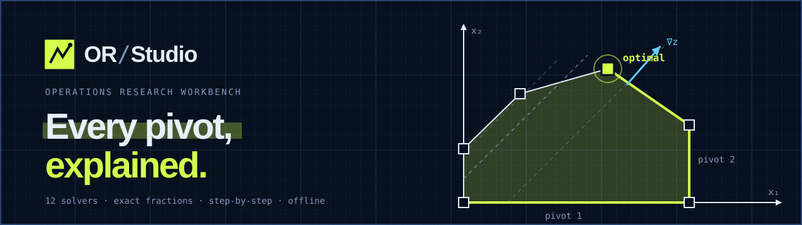
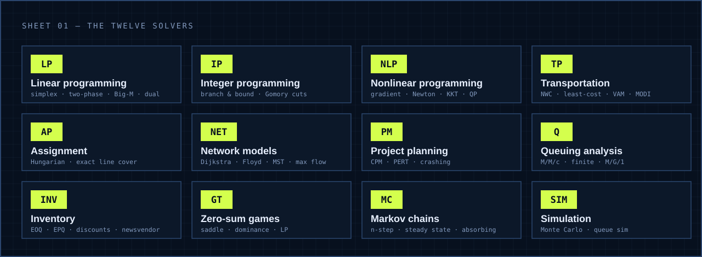
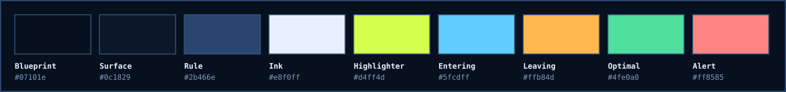

<p align="center">
  
</p>

<p align="center">
  
  
  
  
  
  
  
</p>

<p align="center">
  <b>OR/Studio</b> is a free, offline, in-browser <b>Operations Research workbench</b>.<br />
  Twelve solvers, exact fractions, and every step shown <i>and explained</i> — a modern replacement for TORA.
</p>

---

## Why OR/Studio

Most solvers hand you an answer. OR/Studio hands you the **working**: each tableau, each ratio test, each reason a variable enters or leaves. It is built for learning, checking homework by hand, and presenting a solution to a class.

| | |
|---|---|
| **Exact arithmetic** | Pivots, MODI, Gomory cuts, branch & bound, Markov chains and games use arbitrary-precision rationals. Big-M and prohibited routes use a symbolic `M`, never a large number. |
| **Every step explained** | A step player with a ruled slider, a plain-language reason for each move, and the rule that was applied. |
| **Tutor mode** | The solver pauses and *you* choose the entering variable, the leaving row, the next node… A wrong answer is explained, with the misconception named. |
| **Diff mode** | Type in your own working; OR/Studio finds the first step where it diverged and infers why. |
| **Honest edge cases** | Unbounded, infeasible, degenerate, cycling, alternate optima, negative cycles, disconnected graphs — each is detected and explained, not hidden. |
| **Private by design** | No account, no server, no network calls. Everything runs and is stored in your browser; it installs as an offline app. |

<p align="center"></p>

## The twelve solvers

| Module | Methods |
|---|---|
| **Linear programming** | Simplex · Two-phase · Big-M · Dual simplex · Graphical (draggable constraints) · Exact sensitivity analysis and what-if |
| **Integer programming** | Branch & bound (zoomable tree, three node-selection rules, incumbent chart) · Gomory fractional and mixed-integer cuts |
| **Nonlinear programming** | Gradient and Newton with symbolic derivatives and contour plots · KKT verification · Exact quadratic programming |
| **Transportation** | North-west corner · Least-cost · Vogel · MODI with the closed loop drawn · Stepping-stone · Method comparison · Prohibited routes |
| **Assignment** | Hungarian method with exact minimum line cover · Maximisation · Rectangular problems |
| **Network models** | Click-to-draw graph · Dijkstra · Bellman–Ford · Floyd–Warshall · Kruskal · Prim · Max flow with residual graph and minimum cut |
| **Project planning** | CPM · PERT with on-time probability · Floats · Gantt and AON diagrams · Exact time–cost crashing |
| **Queuing** | M/M/1 · M/M/c · M/M/1/N · M/M/c/N · Machine servicing · M/G/1 · Optimal-server cost model |
| **Inventory** | EOQ · EPQ · Planned shortages · All-units and incremental discounts · Newsvendor |
| **Zero-sum games** | Saddle points · Dominance · Graphical solution · Exact LP method |
| **Markov chains** | n-step transitions · Steady state · Classes and periodicity · Absorbing analysis · First-passage times |
| **Simulation** | Seedable generators · Monte Carlo with confidence intervals · Multi-server discrete-event queue |

Plus a **problem library** of 55 worked textbook problems, each re-solved and checked by the test suite.

## Export, save and share

- **PDF** — a print-ready A4 report: problem, answer box, every numbered step with stacked fractions and typeset formulas, the current figure, and notes. Printed through the browser, so you choose *Save as PDF*.
- **LaTeX**, **PNG**, **CSV**, **JSON**, and a self-contained **HTML** report.
- **Save** named models in the browser (rename, delete, download), **open** them again, or **share a link** that carries the whole model in the URL.
- **Autosave** per module, **presentation mode** for classrooms, light and dark themes.

## Quick start

```bash
git clone https://github.com/Jay-Naik2526/or-studio.git
cd or-studio
npm install
npm run dev        # → http://localhost:5173
```

| Script | What it does |
|---|---|
| `npm run dev` | Start the development server |
| `npm test` | Run the unit and property tests |
| `npm run typecheck` | Strict TypeScript check |
| `npm run build` | Type-check and produce a static `dist/` — host it anywhere, no server needed |

### Keyboard

| Key | Action | Key | Action |
|---|---|---|---|
| `/` or `⌘K` | Command palette | `←` `→` | Previous / next step |
| `Space` | Play / pause | `Home` `End` | First / last step |
| `1`–`9` | Jump to a step | `P` | Presentation mode |

## How it is verified

The solvers are pure TypeScript with no UI dependency, and they are tested against **independent oracles**, not against themselves:

- **Linear programs** — vertex enumeration and strong-duality checks on thousands of random instances.
- **Integer programs and assignment** — exhaustive enumeration.
- **Transportation, max flow and games** — re-formulated as LPs and compared.
- **Shortest paths and spanning trees** — Dijkstra, Bellman–Ford and Floyd–Warshall must agree; Kruskal and Prim must agree.
- **The problem library** — every `check` value in all 55 problems is re-derived.

Inputs have been fuzzed with empty, negative, huge, `1/0` and non-numeric values: no module may crash or freeze the page.

## Project layout

```
src/core        pure TypeScript solvers — no React, no DOM
  math          bigint Rational and the symbolic M number
  solvers       lp · integer · transport · network · project · queuing …
src/components  shell, workspace frame, per-module screens, visualisations
src/data        serialisable model specs and the problem library
src/lib         router, persistence, report and export
tests           unit and property tests, with brute-force oracles in tests/helpers
docs            README graphics
```

## Design

The interface is a **drafting sheet**: a graph-paper grid, ink-black chrome in light mode, a blueprint navy in dark mode, square corners, 1 px rules and registration marks. A single highlighter-lime accent marks the active state, the pivot and the primary action. Type is Geist for text and Geist Mono for numerals and labels, bundled so the app works offline.

<p align="center"></p>

## Known limits

- Separable programming (an NLP extra) is not implemented.
- *Save as PDF* goes through the browser's print dialog rather than generating a file directly.
- The nonlinear module works in floating point; every other solver is exact unless a method states otherwise.

## Licence

MIT — see [LICENSE](LICENSE).
